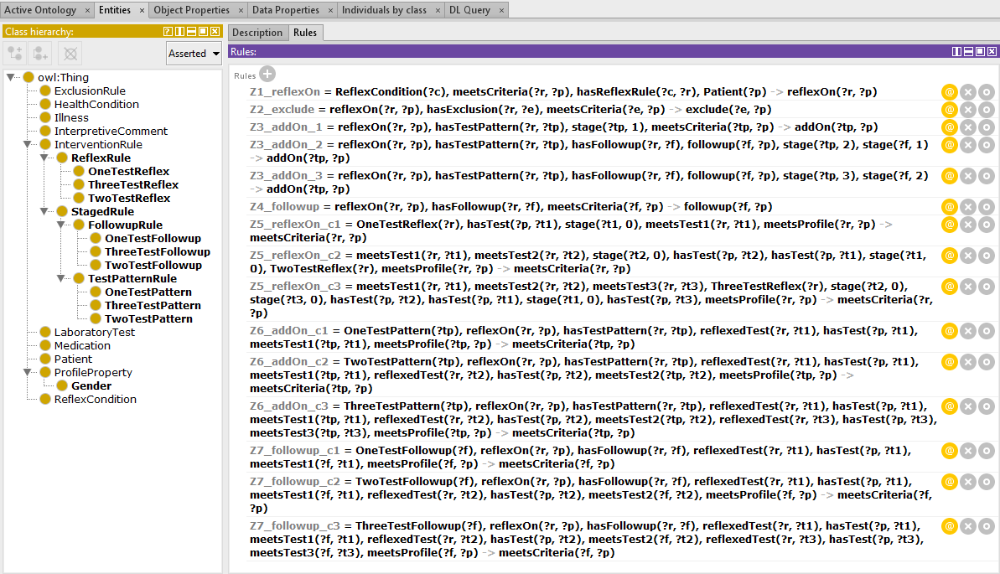

# ReflexOntology

The core [ReflexOntology](https://github.com/william-vw/ReflexOntology/blob/main/reflex-ontology.owl) is implemented by a set of domain-agnostic classes and SWRL rules that implement reflex protocols. 

It is illustrated here: 

One can implement domain-specific clinical criteria (e.g., endocrinology) by extending the ReflexOntology with domain-specific SWRL rules, as illustrated by the [Pituitary Dysfunction reflex ontology](https://github.com/william-vw/ReflexOntology/blob/main/pituitary-reflex-ontology.owl).

Some notes:
- Due to limitations of SWRL (and OWL), some expressions are not as elegant as they could be; i.e., where we had to resort to explicly enumerating the tests associated with a reflex rule or follow-up rule.
- Due to apparent limitations of the Pellet reasoner, the `swrlb:subtract` builtin is not supported; hence, currently we explicitly state that a test-pattern of stage 2 can be triggered when a follow-up rule of stage 1 was triggered; a test-pattern of stage 3 can be triggered when a follow-up rule of stage 2 was triggered; and so on.

In future work, we aim to use a more expressive Semantic Web formalism such as <a href="https://github.com/w3c/N3">Notation3</a> with its range of builtins, support for (scoped) negation as failure and universal quantification.
